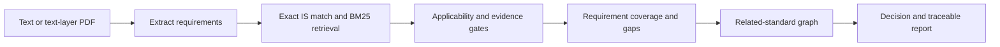

# SpecWise

### Evidence-grounded Indian Standards decision support for public procurement

**Smart India Hackathon 2026 · SIH26108**

SpecWise helps procurement teams turn a product description or tender text into a traceable shortlist of relevant Indian Standards. It shows why a standard matched, what evidence supports it, which requirements remain uncovered, and when the system cannot safely recommend a primary standard.

> **Prototype notice:** SpecWise is an independent hackathon prototype, not an official BIS service. Its curated corpus is limited and is not the complete BIS catalogue. Always confirm requirements with BIS and qualified procurement or engineering staff.

## Try the live prototype

| | Link |
|---|---|
| Web app | [specwise-sih26108.web.app](https://specwise-sih26108.web.app) |
| API health | [specwise-sih26108.onrender.com/api/v1/health](https://specwise-sih26108.onrender.com/api/v1/health) |
| Interactive API docs | [specwise-sih26108.onrender.com/docs](https://specwise-sih26108.onrender.com/docs) |

### A one-minute judge walkthrough

1. Open the web app and submit **“openwell submersible pumpset for agricultural irrigation”**. Review the recommendation, evidence and certification panel.
2. Try **“generic submersible pump”**. SpecWise should abstain from naming a primary standard when the product type is unclear.
3. Try **“fire sprinkler system”**. This is outside the pump-focused corpus and should not receive a pump as its primary standard.
4. Open the detailed audit panel to inspect extracted requirements and coverage gaps; use **Resources** to browse the corpus and its provenance.

## What the prototype demonstrates

- **Traceable retrieval:** combines exact Indian Standard identifier matching with BM25 lexical retrieval.
- **Deterministic safeguards:** product applicability, lifecycle, evidence, and requirement coverage checks are applied after retrieval. A retrieved candidate is not automatically a recommendation.
- **Explicit uncertainty:** results use four states—`RECOMMEND`, `REVIEW`, `ABSTAIN`, and `OUT_OF_CORPUS`.
- **Procurement context:** results can include a primary product standard, related standards, evidence references, certification/QCO status, and uncovered requirements.
- **Tender input:** accepts text and includes PDF text-layer extraction. Scanned/image-only PDFs require OCR, which is not implemented.
- **Localized interface:** the UI language selector offers English, Hindi, Kannada, Tamil, and Telugu. This localizes interface text; it does not translate tender content or provide multilingual standards analysis.

## How a request becomes a result



The current deployment uses lexical retrieval. Dense embeddings and cross-encoder reranking are present as optional code paths but are disabled. PDF extraction uses PyMuPDF; OCR is not available.

## Decision states

| State | What it tells the user |
|---|---|
| `RECOMMEND` | A primary product standard passed the current applicability and evidence checks. |
| `REVIEW` | There is a relevant candidate or unresolved requirement that needs human review. A primary is shown only when a strong primary-product match exists. |
| `ABSTAIN` | The input does not support a sufficiently confident primary recommendation. |
| `OUT_OF_CORPUS` | The request is outside the meaningful scope of the current corpus. |

Related, test, and practice standards are shown as context and are not promoted to primary product standards.

## Prototype corpus

The current corpus is focused on pumps, water handling, and selected tender-cited accessories under BIS committee MED 20. It contains **10 standard records, 18 evidence records, 5 relationships, 8 source records, and 10 benchmark cases**. The live Resources page exposes these records and their references.

The standard records currently cover:

- Product standards: IS 14220:2018 (openwell pumpsets), IS 8034:2018 (submersible pumpsets), and IS 9079:2018 (monoset pumps).
- Related equipment and references: IS 14536:2018, IS 9283:2024, IS 11346:2002, IS 10572:1983, IS 1239:1990, IS 694:2010, and IS 1554:1988.

Corpus counts are prototype scope indicators, not a claim of full catalogue coverage or blanket legal/certification status. Unconfirmed certification or QCO information is labeled as unverified in the result.

## Architecture

```text
Next.js web app (Firebase Hosting)
             │ HTTPS / JSON
             ▼
FastAPI engine (Render)
             │
             ├── Local development: JSON seed corpus
             └── Production: Google Cloud Firestore
```

| Layer | Current implementation |
|---|---|
| Frontend | Next.js 14, React 18, TypeScript, Tailwind CSS |
| API and policy engine | Python, FastAPI, Pydantic |
| Retrieval | Exact IS identifier matching and BM25 |
| PDF text extraction | PyMuPDF (no OCR) |
| Production hosting | Firebase Hosting and Render; Firestore corpus |

## Run locally

Requirements: Python 3.11+ and Node.js/npm.

```bash
git clone https://github.com/ashishlabs-23/specwise-sih26108.git
cd specwise-sih26108

python -m venv .venv
# macOS/Linux
source .venv/bin/activate
# Windows PowerShell: .venv\Scripts\Activate.ps1

pip install -r requirements.txt
uvicorn app.api.main:app --reload --port 8000
```

In another terminal:

```bash
cd frontend
npm install
npm run dev
```

Open [http://localhost:3000](http://localhost:3000). The local API defaults to the JSON seed corpus. To point the frontend at another API, set `NEXT_PUBLIC_API_URL` in `frontend/.env.local` before starting/building it.

## API and validation

- `POST /api/v1/analyze` — analyze a text request.
- `POST /api/v1/recommend` — alias for text analysis.
- `POST /api/v1/upload-pdf` — analyze a PDF supplied as multipart field `file` (25 MiB maximum; text layer required).
- `GET /api/v1/resources` — inspect corpus records and counts.
- `GET /api/v1/health` — inspect service and corpus health.

Run from the repository root:

```bash
python -m pytest
python scripts/freeze_check.py
python scripts/validate_data.py
npm run build
```

## Current limits

- The corpus is curated and narrow; retrieval can return candidates that still fail applicability checks.
- Retrieval is lexical; dense retrieval and reranking are disabled.
- Multilingual UI labels do not imply multilingual query or PDF understanding.
- Scanned PDFs are not OCR-processed. Production browser upload behavior should be validated separately from API or local tests.
- SpecWise is decision support, not a legal compliance determination or a replacement for checking current BIS publications and applicable orders.

## Repository map

```text
app/          FastAPI routes, extraction, retrieval, policy, graph and reports
data/         Seed corpus and evaluation data
evaluation/   Benchmark runner
frontend/     Next.js application
scripts/      Corpus validation and determinism checks
tests/        Unit, API, and browser acceptance tests
```
